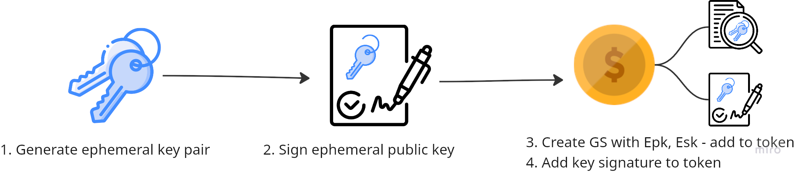
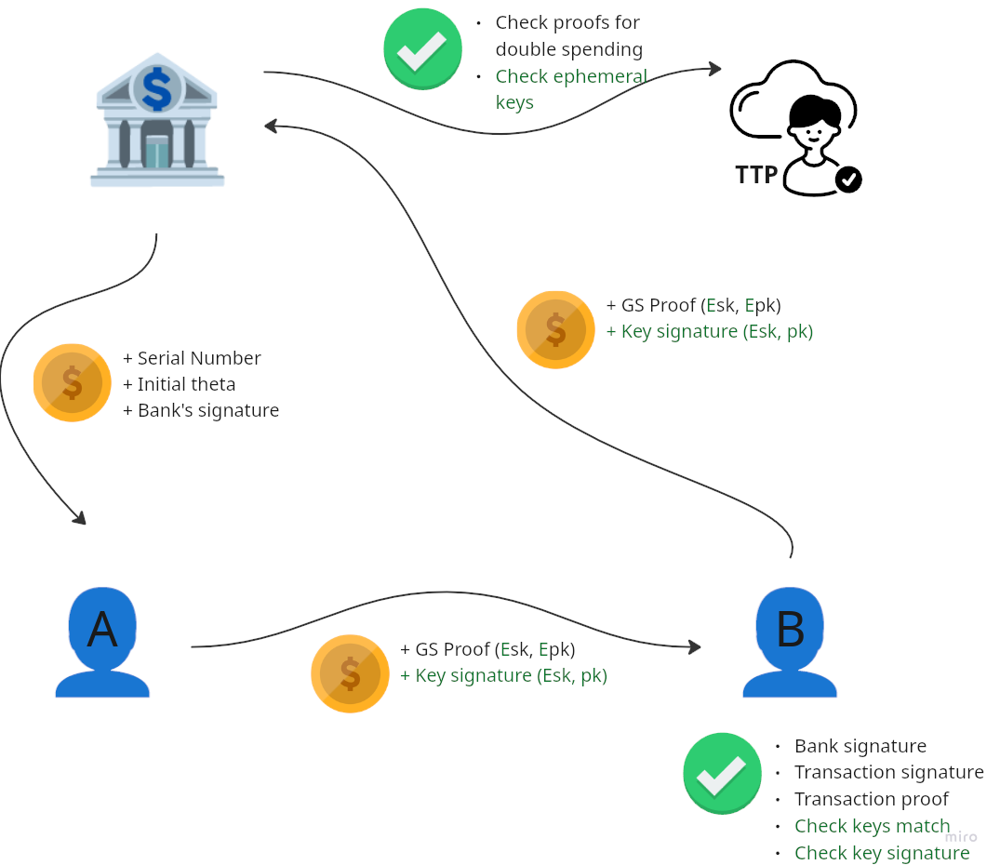

# Class of 2025 Euro 1 Team 3 — Project Overview

**Blockchain Engineering (CS4160) — TU Delft**

---

## Authors

- **Jan Bryczkowski** (`5489903`)
- **Stanisław Howard** (`5533368`)
- **Filip Błaszczyk** (`5575958`)
- **Daniel Lihotský** (`5518199`)
- **Christiaan Molier** (`6334385`)

---

## Introduction

This document provides an overview of the project developed for the Blockchain Engineering (CS4160) course at TU Delft.
We decided to extend the existing OfflineEuro app by implementing two new features:
two-factor authentication (2FA) and per-transaction ephemeral keys.
These features together aim to improve the overall security of the app.
While 2FA ensures that only legitimate users can access and operate their wallets—protecting against unauthorized access—the use of ephemeral keys complements this by ensuring that, even if access is gained or a key is compromised, individual transactions remain unlinkable and secure.

## 2FA

## Ephemeral Keys

The old version of the OfflineEuro app generated a key pair for each user, which was then used to sign every transaction.
This made the transactions linkable, but more importantly if an attacker would gain access to the private key, they can fully impersonate the user and it will compromise all past and future transactions.

Our solution is to generate a new key pair for each transaction, thus ensuring that even if an attacker gains access to the private key, they can only compromise a single transaction.
To retain the auditability and accountability at deposit time, we use a Schnorr signature on the ephemeral public key, which is then included in the token.
This way, the user proves that they generated the transaction and can be held accountable at deposit time, while ensuring that each transaction is unlinkable and secure.
The flow of the application is updated as follows:

So in addition to all of the other steps when receiving a euro the user should generate a new ephemeral key pair, sign the ephemeral public key with their long-term private key, and include the signature in the token.

Then the user (or bank) that receives the euro token should (in addition to the other steps) verify the signature on the ephemeral public key with the sender's long-term public key and check that the ephemeral key used in the GS transaction proof matches with the one signed.

This is a simplified example diagram of a scenario where user A withdraws a token sends it to user B and that user deposits the euro with the bank verifying with the TTP.
The added differences are indicated in green.

This ephemeral key functionality is integrated inside of the inner workings of the application, without a change on the front-end.
To use it the user just uses the application as normal, with the added benefit that their transactions being unlinkable and secure.